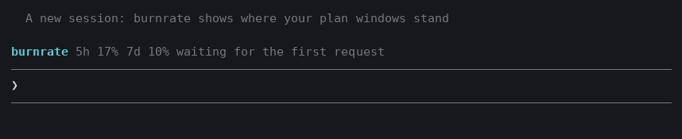
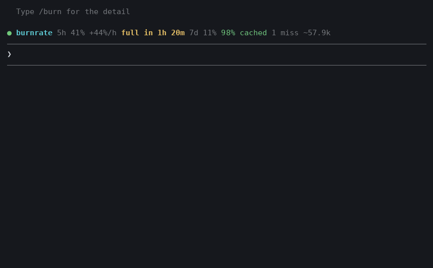

# burnrate

Live quota and prompt-cache monitor for Claude Code: how fast your plan windows are filling and when they run out, plus your prompt-cache misses and an estimate of the tokens each one rewrote.



> **Status: early.** The meter works and is tested, but it has not been tuned against many real sessions yet.

```
● burnrate 5h 23% +4%/h 7d 41% 98% cached
● burnrate 5h 62% +30%/h full in 1h 16m 7d 41% 98% cached
✖ burnrate 5h 24% +4%/h 7d 41% 0% cached miss: model changed, ~81k rewritten
```

## What it shows

- **The row above the prompt:** your plan windows with the pace of the most urgent one, a warning when it will fill before it resets, how much of the last request the cache served, and a miss when there was one. A window turns yellow at 70% and red at 90%. On a narrow terminal the detail goes and the window and its warning stay.
- **`/burn`:** a pane with the session's totals, each miss with what is known about it, the plan windows with their reset times, pace and where that pace leads, and the last requests one by one. `/burn close` shuts it.



Both animations are generated from the mod's own rendering code with a scripted session (`demo/make-demo.ts`, `demo/render-gif.py`).

## Pace

The pace is how fast a plan window is filling: points per hour for the five-hour window, per day for the seven-day one. It is measured from the window's own readings, over the last half hour for the five-hour window and up to six hours for the others, and it falls back to "steady" by itself when you stop sending.

- **`full in 1h 16m`** appears only when the window would fill before it resets at the current pace. It turns red inside half an hour. A rise of a single point is not enough to raise it.
- **`~74% at reset`** is where the window ends up if the reset comes first.
- **`pace: measuring`** shows until burnrate has enough history: five minutes for the five-hour window, an hour for the others.

It is a projection of the recent past, not a forecast: one heavy turn moves it, and it knows nothing about what you will do next. The windows are your account's, so other sessions and devices move them too.

## What a miss is, and what it is not

A miss is a request that left a fifth or more of the cached prompt unread and wrote it again. burnrate says what it can tell about it:

| Shown as | What it means |
| --- | --- |
| model changed | the request went to a different model than the one before |
| after 12m idle | more than five minutes passed between the previous response and this request |
| likely prefix change | neither of the above. The usual reason is that something ahead of the conversation changed (effort, tools, system prompt, `CLAUDE.md`), but burnrate cannot see that |

The limits:

- **Token counts are estimates**, shown with `~`. The API reports how many tokens were read and written, not which ones, so new content can hide inside a rewrite.
- **No dollars.** The only figure the mod API offers is list price, which is not what a subscription or a custom contract pays. burnrate shows quota and tokens, which are true for everyone.
- **A pause is not an expiry.** The mod API does not say whether a request asked for the 5-minute or the 1-hour cache, so burnrate reports the pause and leaves the conclusion to you.
- **A prompt that shrank is left out.** After `/compact` or a rewind the rewrite is expected, and it cannot be told from a lost cache.
- **Only the main conversation is counted.** Subagents have caches of their own.

## Install

```
/plugin marketplace add nemke82/claude-code-burnrate
/plugin install burnrate@burnrate
```

Mods are early access: start Claude Code with `CLAUDE_CODE_ENABLE_FUNCTION_HOOKS=1` (2.1.259 or later). The mod API may change between releases.

## Develop

```sh
claude plugin validate burnrate
claude plugin test burnrate
CLAUDE_CODE_ENABLE_FUNCTION_HOOKS=1 claude --plugin-dir burnrate   # hot reloads on save
```

## Licence

MIT
